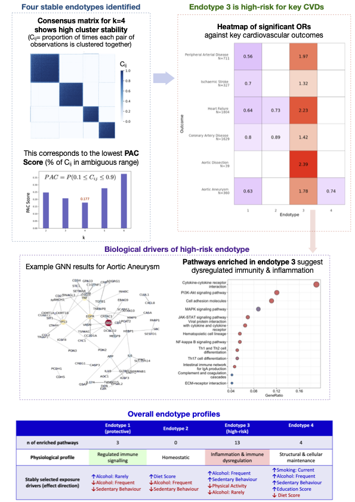

# Unsupervised Machine Learning for Proteomic-driven Disease Risk Profiling

_Authors: M.Serova, J. Cutteridge, K. Ayres, G. Gonzales Sandes, Z. Xu_

This repository contains the full analytical pipeline for our project exploring **proteomics-driven stratification of hypertension using unsupervised machine learning**. Using plasma proteomic data from the UK Biobank, we identify clinically meaningful hypertension endotypes and investigate their association with cardiovascular outcomes.

This project combines **Gaussian Mixture Models within consensus clustering framework**, **differential expression analysis**, **graph neural networks**, and **stability selection LASSO** to highlight how high-dimensional biological data can inform precision medicine in cardiovascular care for hypertension patients.

## Objectives
- Identify stable **molecular endotypes** in hypertensive patients using consensus clustering
- Characterise key **proteins and pathways** that define each endotype
- Assess the relationship between endotype membership and major **cardiovascular events**
- Explore l**ifestyle and behavioural drivers** of high- and low-risk profiles
- Evaluate the **predictive utility** of endotype membership for cardiovascular risk stratification

# Methods Summary
A multi-step analytical pipeline was applied to proteomic data from 29,672 hypertensive individuals in the UK Biobank
- **Consensus Clustering**: Gaussian Mixture Models (GMMs) embedded in a consensus framework identified stable molecular subtypes (endotypes).
- **Cardiovascular Risk Analysis**: Associations between endotypes and six cardiovascular outcomes were evaluated using multivariable logistic regression.
- **Protein & Pathway Characterisation**: Differential expression (via limma and Ridge regression) and KEGG pathway enrichment identified key biological signatures.
- **Graph Neural Networks**: Attention-based GNNs were used to detect important proteins and protein–protein interactions associated with disease risk.
- **Lifestyle Associations**: Stability selection with LASSO uncovered behavioural factors that distinguish high- and low-risk endotypes.
- **Prediction Models**: ROC curves evaluated the incremental predictive value of endotype membership when added to conventional risk models.

## Key Findings
- Four stable endotypes of hypertension were uncovered from proteomic data, each with distinct biological signatures.
- Endotype 3 emerged as the high-risk group, significantly associated with increased odds of all six key CVD outcomes, and exhibiting a profile of immune dysregulation and inflammation. Behavioral characterisation of this endotype revealed frequent alcohol use, low physical activity, and high sedentary behaviour.
- Endotype 1, by contrast, showed a protective profile: reduced odds across all outcomes, lower inflammatory signalling, and a balanced cytokine profile. It was was associated with moderate/rare alcohol use and greater physical activity
- Prediction models showed incremental improvements in AUC when incorporating endotype information, particularly for peripheral arterial disease and aortic aneurysm.

